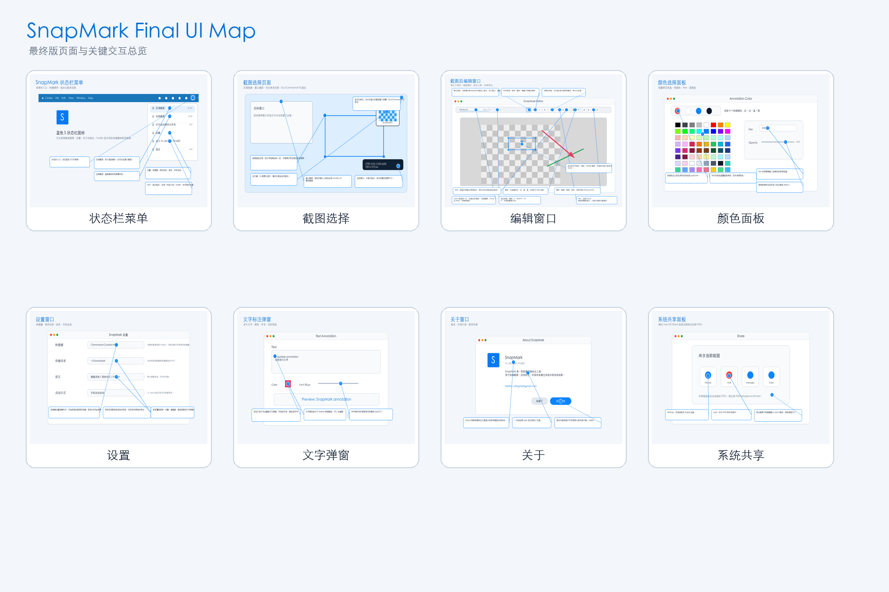

# SnapMark 最终需求说明文档

最后更新：2026-06-26  
当前构建：`1.44.0626`

## 1. 产品定位

SnapMark 是一款 macOS 状态栏截图标注工具，用于快速截图、添加标注，并保存或通过系统共享发送结果。

核心目标：

- 用菜单栏入口或全局快捷键快速进入截图流程。
- 截图后立即进入轻量编辑器，完成箭头、形状、文字、马赛克、放大镜、画笔和区域搬运。
- 自动保存原始截图；编辑后退出时若有修改，另存新文件，避免覆盖原始截图。
- 通过复制、保存、系统共享快速把结果交给其他应用。

## 2. 页面总览



当前产品包含 8 个主要界面/状态：

1. 状态栏菜单
2. 截图选择页面
3. 截图后编辑窗口
4. 颜色选择面板
5. 设置窗口
6. 文字标注弹窗
7. 关于窗口
8. 系统共享面板

## 3. 用户流程

### 3.1 快速区域截图

1. 用户点击状态栏蓝色 `S` 图标，选择“区域截图”，或按全局快捷键。
2. 进入截图选择层。
3. 用户拖拽框选区域。
4. SnapMark 按屏幕 backing scale 转换为实际像素截图。
5. 进入编辑窗口，原始截图自动保存。

### 3.2 窗口截图

1. 用户进入截图选择层。
2. 鼠标悬停在可见窗口上时显示窗口边框。
3. 用户单击目标窗口。
4. SnapMark 使用 window id 截取整窗，并进入编辑窗口。

### 3.3 全屏截图

1. 用户从菜单选择“全屏截图”，或在截图选择层未命中任何窗口时单击空白区域。
2. SnapMark 捕获所有屏幕组成的完整画面。
3. 自动保存并进入编辑窗口。

### 3.4 编辑、保存与共享

1. 用户在编辑窗口添加标注。
2. 可撤销、复制、保存、系统共享。
3. 用户按 `Esc` 或 `Command+Q` 退出编辑窗口。
4. 若有修改，SnapMark 自动另存编辑结果为新 PNG，并释放窗口和画布资源。

## 4. 功能需求

### 4.1 状态栏菜单


需求：

- 菜单栏只显示蓝色 `S` 状态图标。
- 菜单包含：区域截图、全屏截图、打开自动保存文件夹、设置、关于、退出。
- 每个菜单项前有语义图标。
- 设置菜单标题显示当前快捷键 shortname。
- 状态栏 tooltip 显示版本、实际快捷键和 `mailto: cdingstar@gmail.com`。

### 4.2 截图选择页面


需求：

- 支持拖拽选择任意区域。
- 支持四个方向拖拽，最终像素区域一致。
- 支持半像素边界修正，确保结果尺寸和提示像素一致。
- 鼠标悬停窗口时显示窗口边框，单击截取整窗。
- 鼠标不在任何窗口上时，单击空白处截取整个屏幕。
- 显示 5x 像素放大镜，靠近边缘时自动换位。
- 坐标提示只显示起点、终点、最终 `width x height px`。
- `Esc` 或 `Command+Q` 退出截图模式。

### 4.3 编辑窗口


需求：

- 画布使用灰白棋盘底，截图内容居中显示。
- 标注坐标按当前 zoom 反算到图片像素，导出不受 zoom 影响。
- 拖拽创建、移动、缩放标注时，鼠标超出图片边界仍响应方向，但最终位置限制在图片范围内。
- 选中箭头、矩形、文字、马赛克、放大镜或手形贴片后，可按 Delete/Forward Delete 删除。
- 当前 active 标注在点击空白、画布失焦、切换工具或开始平移时自动 apply。
- 多个标注重叠时优先选中更小或覆盖更靠上的目标，避免无法操作小元素。

#### 4.3.1 缩放区域

- `ZoomInfoSliderView` 同一行显示两类信息：
  - 左侧：缩放比例和匹配模式，例如 `100% 1:1`、`63% Best Fit`、`72% Fit In`。
  - 右侧：截图像素尺寸，例如 `2940 x 1912 px`。
- 鼠标悬停时显示 zoom slider，支持精细缩放。
- Fit 按钮循环 `1:1`、`Best Fit`、`Fit In`。
- 任意重复的实际比例都会排除，不只排除 Fit In。
- `Best Fit` 给边框保留安全余量。
- `Fit In` 最大化显示完整内容，并让宽或高至少一边贴近窗口边界。
- 缩放范围覆盖 `1:32` 到 `8:1`。

#### 4.3.2 多功能工具按钮

| 按钮 | 当前用途 | 再次点击已选按钮 | 额外行为 |
| --- | --- | --- | --- |
| 箭头 | 绘制箭头或直线 | 循环：实心箭头、凹口箭头、直线 | 水平拖拽不会被最小尺寸逻辑突然改向 |
| 形状 | 绘制形状 | 循环：矩形、圆形、椭圆 | 选中后可移动、缩放、删除 |
| 文字 | 添加文字 | 无循环 | 点击已有文字可选中；双击可重新编辑内容、颜色、字号 |
| 马赛克 | 遮挡区域 | 循环：无外框、有外框 | 默认无红色外框 |
| 放大镜 | 创建局部放大区域 | 无循环 | 可选中、移动、缩放、删除 |
| Pen | 自由画线 | 循环：S、M、L | 图标显示当前线宽；小箭头菜单可直接选择粗细 |
| 手形 | 区域搬运/贴片 | 循环：区域搬运、拖拉画布 | 区域搬运可框选贴片；Option 拖动已有贴片会复制 |
| 颜色 | 设置新标注颜色 | 左侧循环：红、白、蓝、黑 | 右侧箭头打开 8x8 色盘、Hex、透明度 |
| 操作组 | 撤销、复制、保存、共享 | 不循环 | 共享调用 macOS 系统分享，支持 AirDrop、Mail 等 |

### 4.4 颜色选择面板


需求：

- 工具栏颜色按钮左侧 2/3 区域循环常用色：红、白、蓝、黑。
- 右侧 1/3 区域显示下拉箭头，点击打开轻量色盘。
- 色盘在单页内完成，不使用复杂多模式系统颜色面板。
- 顶部 4 个快速色选中后立即应用并自动收起。
- 提供 8x8 标准色盘。
- 支持 Hex 输入。
- 支持透明度，并实际写入标注颜色 alpha。

### 4.5 设置窗口


需求：

- 支持配置区域截图快捷键。
- 支持配置自动保存目录，默认 Downloads。
- 支持语言设置：跟随系统、简体中文、English。
- 支持开机自动启动。
- 录制新快捷键时暂停当前 hotkey。
- 录制取消、窗口关闭或冲突时恢复旧快捷键。
- 成功注册后才保存新快捷键。

### 4.6 文字标注弹窗


需求：

- 支持多行文字输入。
- 支持文字颜色。
- 支持字号调节。
- 支持实时预览。
- 新建文字按内容和字号估算默认尺寸。
- 双击已有文字可重新编辑内容、颜色和字号。

### 4.7 关于窗口


需求：

- About 菜单标题显示当前版本和构建时间。
- About 正文显示版本信息。
- About 正文显示一句 app 介绍：
  - `SnapMark 是一款轻量截图标注工具，用于快速截图、添加标注，并保存或通过系统共享发送结果。`
- About 正文显示 `Mailto: cdingstar@gmail.com`。
- 提供“联系作者”按钮，点击后打开系统默认邮件客户端。

### 4.8 系统共享面板


需求：

- 编辑窗口共享按钮生成当前渲染结果的临时 PNG。
- 调用 `NSSharingServicePicker`。
- 支持 AirDrop、Mail、Messages 等系统服务。
- 共享导出的图片像素尺寸不受编辑窗口 zoom 影响。

## 5. 保存、导出与资源释放

- 原始截图进入编辑窗口前自动保存。
- 编辑窗口关闭时：
  - 没有用户修改：保留原始截图。
  - 有用户修改：另存新的自动保存 PNG 文件名。
- 复制、保存、共享导出的是渲染后的完整图像。
- 导出像素尺寸始终等于截图原始像素尺寸。
- 退出截图、编辑、设置等临时上下文时释放不必要引用，降低长期内存占用。

## 6. 快捷键与退出

- 默认区域截图快捷键：`Command + Control + A`。
- 如果被占用，自动 fallback 到 `Command + Control + S`，再到 `Command + Control + Q`。
- 快捷键注册成功但实际按下无响应时，会自动恢复 fallback。
- 以下状态支持 `Esc` 或 `Command+Q` 退出：
  - 截图选择层
  - 编辑窗口
  - 设置窗口
  - 快捷键录制状态
  - 文字标注弹窗

## 7. 国际化

- 默认语言跟随系统。
- 至少支持简体中文和 English。
- 可见文案统一走 `Localization.swift`。
- 覆盖范围：
  - 状态栏菜单
  - 设置窗口
  - 截图选择提示
  - 编辑器 toolbar tooltip
  - 颜色选择器
  - 文字弹窗
  - About 窗口

## 8. 权限与打包

- macOS 需要屏幕录制权限。
- App 使用固定 bundle id：`dev.snapmark.app`。
- 构建脚本优先使用 Apple Development 证书签名，降低重复授权概率。
- 构建脚本执行流程：
  1. 生成图标资源。
  2. Release build。
  3. 自动递增版本号。
  4. 复制 app bundle 资源。
  5. 签名。
  6. 运行功能测试。
  7. 安装到 `/Applications/SnapMark.app` 或 `~/Applications/SnapMark.app`。
  8. 启动新 app。

## 9. 自动化测试覆盖

当前自动化覆盖核心 P0 功能，包括：

- 区域截图、全屏截图、窗口截图。
- 半像素边界和四方向拖拽坐标。
- 截图放大镜。
- 箭头、形状、文字、马赛克、放大镜、Pen、手形工具。
- 标注选中、移动、缩放、删除、越界 clamp。
- ZoomInfoSliderView、Best Fit、Fit In、重复比例排除。
- 自动保存、编辑退出另存、资源释放。
- 快捷键 fallback、快捷键录制事务。
- 系统共享。
- 语言设置。
- app bundle、codesign、版本规则、安装并启动。
- 文档和 UI 总览截图存在性。

执行方式：

```bash
Scripts/test.sh
```

完整构建、测试、安装和启动：

```bash
Scripts/build_app.sh
```

## 10. 后续规划

P1：

- Ask ChatGPT
- Send via Mail
- Codex/ClaudeCode 集成
- 自动隐私处理
- API Key、Token、邮箱、电话、人脸自动识别和打码

P*：

- 无限滚动截图
- 视频录屏
- GIF
- OCR
- Pin Image
- Color Picker
- Pixel Ruler
- Screen Measure
- QR Scanner
- Image Compression
- Markdown Image Upload
