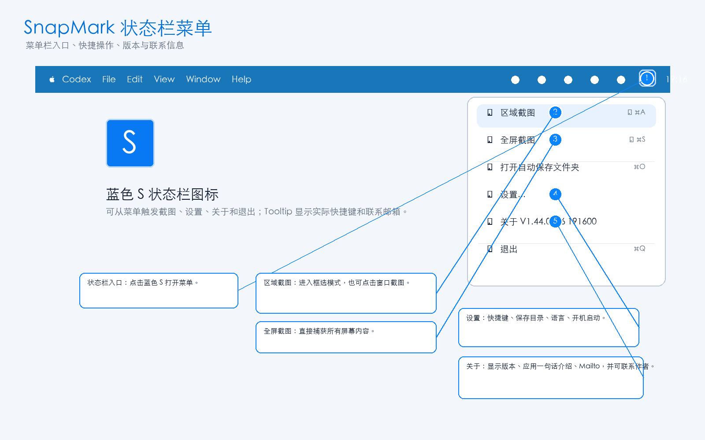
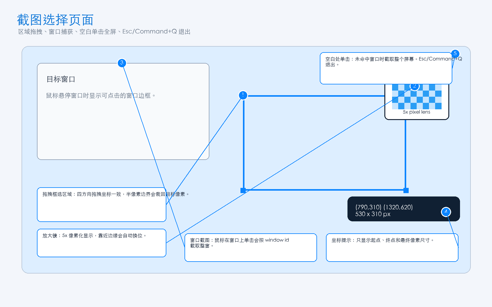
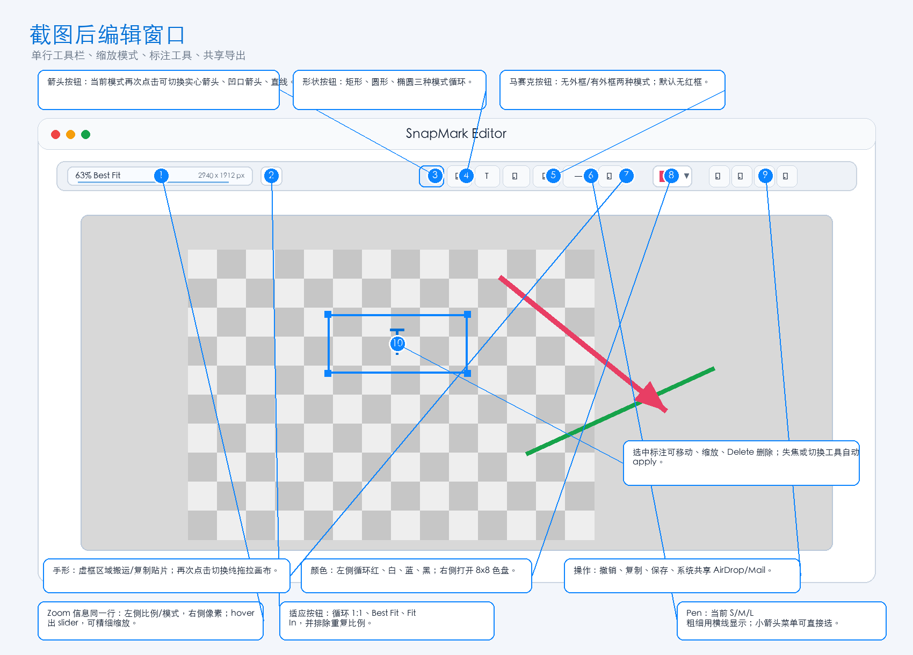
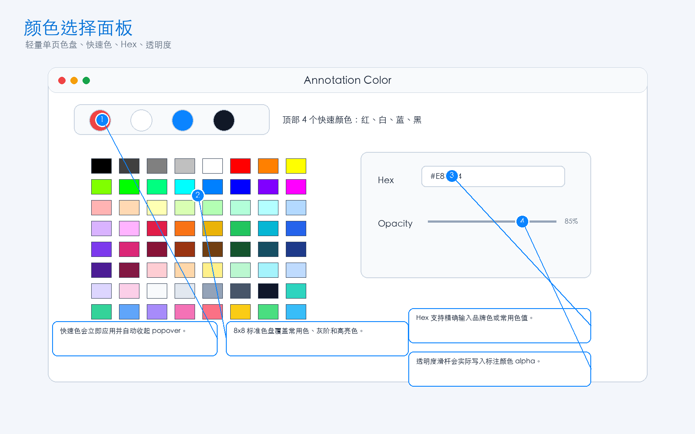

# SnapMark UI Overview

本页是 SnapMark 当前 UI 的标注截图索引。完整需求说明见 [FinalRequirements.MD](FinalRequirements.MD)。

## 状态栏菜单

- 状态栏蓝色 `S` 图标打开菜单。
- 菜单提供区域截图、全屏截图、打开自动保存文件夹、设置、关于和退出。
- About 入口显示版本信息，并在弹窗中提供 Mailto 和“联系作者”按钮。

## 截图选择

- 支持拖拽区域截图、窗口悬停单击截图、空白单击全屏截图。
- 支持 5x 像素放大镜。
- 支持 Esc 或 Command+Q 退出截图模式。

## 编辑窗口

- `ZoomInfoSliderView` 在同一行左侧显示缩放和模式，右侧显示 pixel 尺寸。
- Fit 按钮循环 `1:1`、`Best Fit`、`Fit In`，并排除重复实际比例。
- 工具栏使用 icon：箭头、形状、文字、马赛克、放大镜、Pen、手形、颜色、撤销、复制、保存、共享。
- 多模式按钮会在 tooltip 中显示当前模式和可切换模式。

## 颜色选择面板

- 左侧循环红、白、蓝、黑。
- 右侧箭头打开轻量单页色盘。
- 支持 8x8 标准色盘、Hex 和透明度。

## 设置窗口

- 支持快捷键、保存目录、语言、开机启动。
- 语言默认跟随系统，支持简体中文和 English。
- 快捷键录制使用事务逻辑，冲突或取消会恢复旧快捷键。

## 文字标注弹窗

- 支持多行文字、颜色、字号和实时预览。
- 双击已有文字可重新编辑。
- 文字可选中后移动、缩放和删除。

## 关于窗口

- 显示版本、构建时间、一句话 app 介绍和 `Mailto: cdingstar@gmail.com`。
- “联系作者”按钮会打开系统默认邮件客户端。

## 共享

- 共享按钮生成临时 PNG。
- 通过 macOS `NSSharingServicePicker` 发送到 AirDrop、Mail 等系统服务。

## 文档截图

- 总览图：`Docs/Images/snapmark-ui-overview.png`
- 独立标注截图目录：`Docs/Images/final-ui/`
