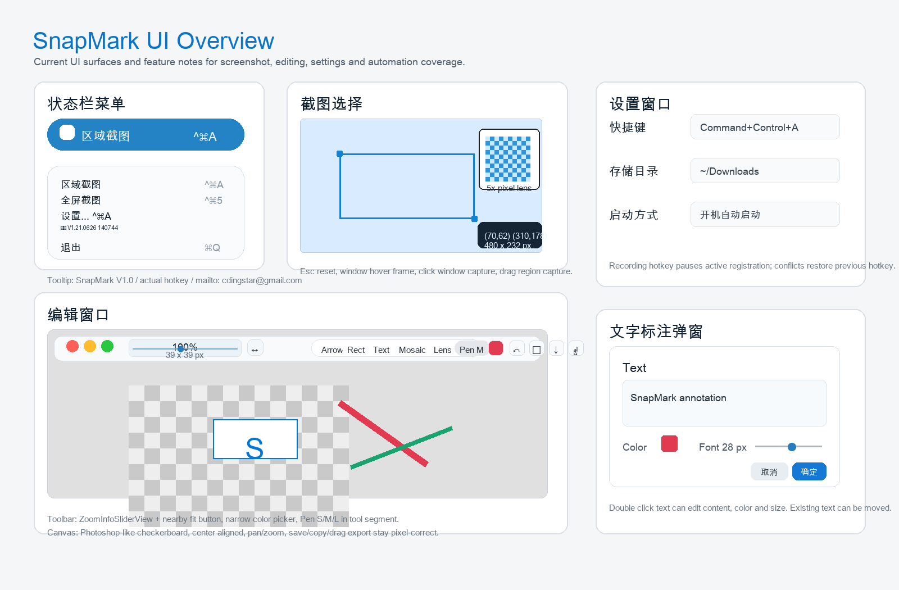

# SnapMark UI Overview

## 状态栏菜单

- 顶部菜单栏只显示图标，不显示 SnapMark 英文名。
- mouseover tooltip 显示 `SnapMark V1.0`、实际快捷键和 `mailto: cdingstar@gmail.com`。
- 菜单包含区域截图、全屏截图、打开自动保存文件夹、设置、关于和退出；设置菜单标题显示实际 hotkey shortname。

## 截图选择

- 区域截图激活后支持 Esc reset。
- mouse move 显示像素化放大镜，窗口右下优先展示，放不下时换位。
- mouse 下方窗口会被虚拟框提示，点击可截整个 window，不点击则继续拖拽选择区域。
- 选区提示只保留一行简要坐标：屏幕起点、终点和最终 `width x height px`。

## 编辑窗口

- 编辑画布使用 Photoshop 风格灰白棋盘底，截图内容居中显示。
- `ZoomInfoSliderView` 将当前 zoom 百分比放在上方、截图像素尺寸放在下方；透明 slider 覆盖在同一个底色区域，mouseover 时明显显示。
- 适应按钮移动到 zoom 信息块旁边，点击循环 current、100%、Best Fit、Fit In，不占用右侧工具区空间。
- 右侧工具保持单行整体：Arrow、Rect、Text、Mosaic、Lens、`Pen M`、窄颜色选择、撤销、复制、保存、拖拽复制。
- Pen 默认 `M`，点击当前 Pen 段可在 `S/M/L` 间切换；Pen 使用当前颜色绘制自由路径。

## 设置窗口

- 可配置截图快捷键、自动保存目录和开机自动启动。
- 录制新快捷键时先暂停当前 hotkey；冲突时提醒并恢复旧 hotkey；Esc、关闭或未完成选择时恢复设置前 hotkey。

## 文字标注弹窗

- 文字标注弹窗支持多行输入、颜色和字号。
- 新建文字的默认显示尺寸按内容长度和字号估算。
- 双击已有文字可修改内容、颜色和字号；文字可选择后拖拽移动。

## 自动化覆盖

- `SMK-P0-ANN-003` 覆盖 Pen `S/M/L` 大小和 toolbar 合并逻辑。
- `SMK-P0-ANN-004` 覆盖 Pen 自由路径按当前颜色绘制。
- `SMK-P0-EDITOR-005` 覆盖 zoom 信息块、透明 slider、相邻适应按钮和右侧工具单行布局。
- `SMK-QA-002` 覆盖本 UI 总览文档和 `snapmark-ui-overview.png` 截图存在性。
